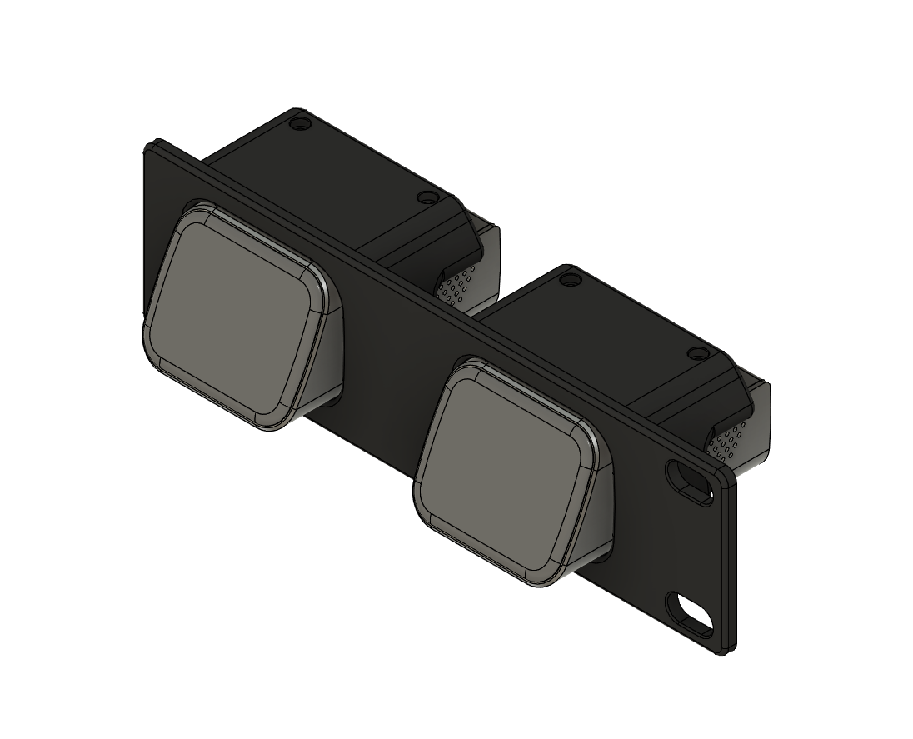
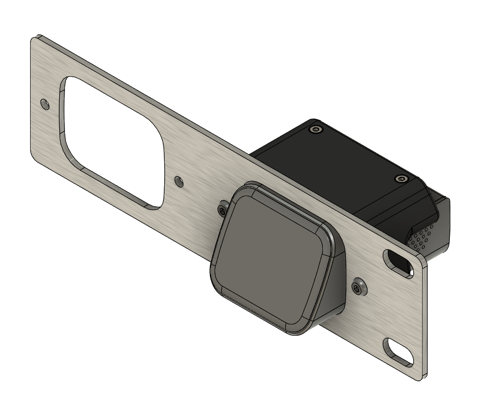
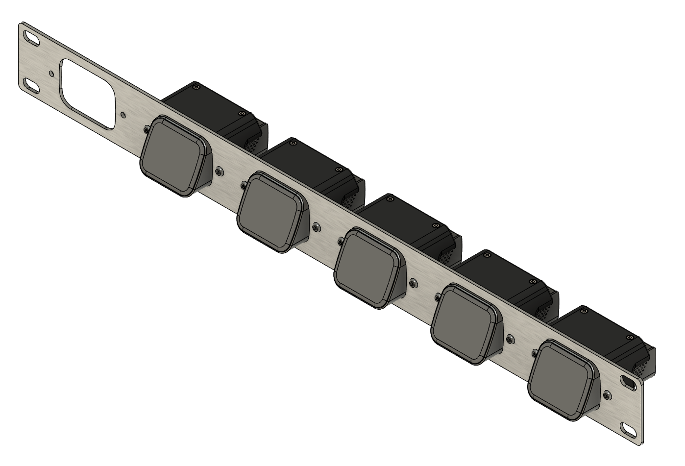

# JetKVM Rackmount Solutions

### Hey all!  If you're here, you probably want a cool mounting solution for your JetKVM into a 1U rackmount form factor.  You're in luck!

**Below I've outlined options for both fully 3D-printed solutions, as well as hybrid solutions utilizing laser-cut aluminum panels paired with 3D-printed parts, and the recommendations on accompanying hardware for each.  All links are US-based, and non-affiliate links.**

### 
********************************************************************************

### 
Files and instructions for each version are in their respective subfolder above!

### 
********************************************************************************

## Fully 3D-Printed Notes
* Available in Short 1-2 module and full-width 1-4 module configurations (mix and match 1-2 module left and right halves).
* Fully printable on common 3D printer bed sizes down to 255x255mm in size (for full-width configuration; Short models can be printed on even smaller printers).
* Able to be printed in two colors for a cool standout effect (full-width only).

## Required Hardware - Fully 3D-Printed
1. **2x M2x16 SHCS Machine Screws (per module - up to 8x total with 4 total modules) - [iexcell - Amazon](https://www.amazon.com/gp/product/B094NSV83Q)**
	* This is a 100-screw pack.  You will have plenty of spares.  Feel free to find a combination kit that includes M2x16 SHCS screws if you don't want 100 of these.
2. **6x M3x4x5 Brass Heatset Inserts (ONLY REQUIRED for full-width configuration) - [PEUTIER - Amazon](https://www.amazon.com/dp/B0CXXS3LHD/)**
	* This kit includes the heatset tip for your soldering iron, and fits most of the older ceramic-style irons. 120 total pieces (they go fast if you print a lot of functional parts).
3. **6x M3x12 SHCS Machine Screws (ONLY REQUIRED for full-width configuration) - [iexcell - Amazon](https://www.amazon.com/dp/B08R3GVJVC)**
	* Another 100-screw pack.  As above, plenty of spares, and feel free to find alternate options.

## Hybrid Aluminum / 3D-Printed Notes
* Available in 1-6 module configurations.
* Requires laser-cut aluminum panels; SendCutSend is a good option in the US.
* Has 3D-printed mounts for the JetKVM modules that get attached to the aluminum panel.

## Required Hardware - Hybrid Aluminum
1. **2x M2x16 SHCS Machine Screws (per module - up to 12x total with 6 total modules) - [iexcell - Amazon](https://www.amazon.com/gp/product/B094NSV83Q)**
	* This is a 100-screw pack.  You will have plenty of spares.  Feel free to find a combination kit that includes M2x16 SHCS screws if you don't want 100 of these.
2. **2x M3x4x5 Brass Hetset Inserts (per module - up to 12x total with 6 total modules) - [PEUTIER - Amazon](https://www.amazon.com/dp/B0CXXS3LHD)**
	* This kit includes the heatset tip for your soldering iron, and fits most of the older ceramic-style irons. 120 total pieces (they go fast if you print a lot of functional parts).
3. **2x M3x8 BHCS Machine Screws (per module - up to 12x total with 6 total modules) - [iexcell - Amazon](https://www.amazon.com/dp/B08H2HTTRT)**
	* Another 100-screw pack.  As above, plenty of spares, and feel free to find alternate options.

