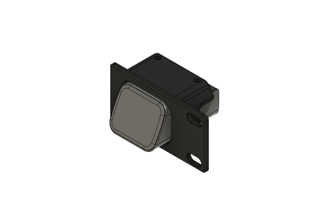
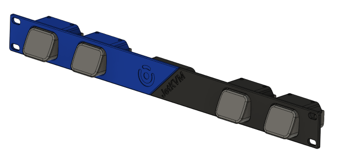
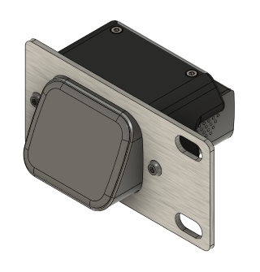
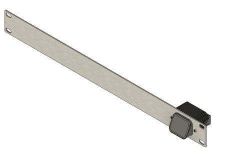

#Update 15Feb2025
Adding STLs for a side panel brace, a 1U front panel blank, a 0.5U blank, a side panel fan holder for 40mm fans (actually I need to update this one, the bolt hole pattern is a little off), a netgear POE switch (untested), and a 1U mount for a 4 outlet 120V power strip.

# Quick update with the plan - 
Planning to purchase standard 10-32 rails and add 3D print STLs for a DIY mini 10" rack.

# Formerly JetKVM Rackmount Solutions

Hey all!  This repo is being updated and integrated to coordinate with the LabStack modular system.  This repo will include standalone 1U and 2U rack options for both 10" (Mini) and standard 19" (19) racks.  These rackmount designs can be used standalone, or in conjunction with a LabStack modular system!

I will update the repo as I work on the integration, and all of the JetKVM designs will be staying in this repo as LabStack Rack designs.  If you have any questions, please open an issue!

-Jared

# JetKVM Rackmount Solutions

## (Also available on [Printables.com](https://www.printables.com/model/1105303-jetkvm-1u-rackmount))

### Hey all!  If you're here, you probably want a cool mounting solution for your JetKVM into a 1U rackmount form factor.  You're in luck!

**Below I've outlined options for both fully 3D-printed solutions, as well as hybrid solutions utilizing laser-cut aluminum panels paired with 3D-printed parts, and the recommendations on accompanying hardware for each.  All links are US-based, and non-affiliate links.**

### 
****************************************************************************************

### 
Fully 3D-Printed Configuration

### 
****************************************************************************************

## Fully 3D-Printed Notes
* Files can be found in the "full3d" folder.
* Available in Short 1-2 module and full-width 1-4 module configurations (mix and match 1-2 module left and right halves).
* Fully printable on common 3D printer bed sizes down to 255x255mm in size (for full-width configuration; Short models can be printed on even smaller printers).
* Able to be printed in two colors for a cool standout effect (full-width only).

## Required Hardware
1. **2x M2x16 SHCS Machine Screws (per module - up to 8x total with 4 total modules) - [iexcell - Amazon](https://www.amazon.com/gp/product/B094NSV83Q)**
	* This is a 100-screw pack.  You will have plenty of spares.  Feel free to find a combination kit that includes M2x16 SHCS screws if you don't want 100 of these.
2. **6x M3x4x5 Brass Heatset Inserts (ONLY REQUIRED for full-width configuration) - [PEUTIER - Amazon](https://www.amazon.com/dp/B0CXXS3LHD/)**
	* This kit includes the heatset tip for your soldering iron, and fits most of the older ceramic-style irons. 120 total pieces (they go fast if you print a lot of functional parts).
3. **6x M3x12 SHCS Machine Screws (ONLY REQUIRED for full-width configuration) - [iexcell - Amazon](https://www.amazon.com/dp/B08R3GVJVC)**
	* Another 100-screw pack.  As above, plenty of spares, and feel free to find alternate options.

## Slicer Configuration and Info
* All models are saved in the correct orientation to the build plate.  You can rotate the part, but do not change the side that touches the bed!
* NONE of the models require supports.  Turn supports off in your slicer for these models.
* Recommended Slicing Settings:
	* Layer Height: 0.2mm
	* Perimeters: 4
	* Top/Bottom Layers: 5
	* Infill: 40%
* To help prevent part warping, please wait until the bed has fully cooled before removing the part from the bed! (This goes double for the full-width parts!)

## Short Model Info
* Choose your specific configuration from the STL files in the list, and import into your slicer.
	* Short models will be listed with "Short" in their title.
	* Files listed as "Left Mount" will mount on the left half of the rack.  Files listed as "Right Mount" will mount on the right half of the rack.

## Short Model Assembly
1. Unscrew the 2x Phillips head screws from the top of the JetKVM module, and slide the module into the 3D-printed housing until the screw holes in the printed part align with the holes in the JetKVM device.
2. Install 2x M2x16mm SHCS machine screws (per module) thru the printed part and into the JetKVM module.  Snug the screws using an Allen Key of the correct size.
3. Connect cables to the JetKVM device, and install JetKVM into rack.
	* Be careful when screwing the printed mount into your server/network rack, and take care not to tighten the rack screws too tight!

## Full-Width Model Info
* You will need one "Left" and one "Right" option for a full-width 1U mount.
	* Pick one of the 3 module options for each side: 1x Module, 2x Module, Blank
		* 1x Module Left + Blank Module Right = 1x JetKVM module on the left side of the rackmount.
		* 2x Module Left + 1x Module Right = 3x JetKVM modules total, with 2 on the left side and one on the right side of the rackmount.
		* 1x Blank Module Left + 1x Blank Module Right = Full Blanking panel with a JetKVM logo...  Not useful for mounting JetKVM devices, but useful as a blanking plate!
* You will need a printed brace to join the Left and Right halves.  The brace is in the STL folder, and is just called "Brace".

## Full-Width Model Assembly
1. Install 3x heatset inserts into each of the Left and Right halves, 6x in total, with a soldering iron (and heatset insert tip, if available).
2. Install the Brace over the two halves of the 1U rackmount.
3. Insert 6x M3x10 SHCS machine screws into the base and tighten down.  NOTE: The screws will start to feel tight before bottoming; continue to screw in until tight!  This acts as a lock washer inside the printed part.
4. Unscrew the 2x Phillips head screws from the top of the JetKVM module, and slide the module into the 3D-printed housing until the screw holes in the printed part align with the holes in the JetKVM device.
5. Install 2x M2x16mm SHCS machine screws (per module) thru the printed part and into the JetKVM module.  Snug the screws using an Allen Key of the correct size.
6. Connect cables to the JetKVM device, and install JetKVM into rack.
	* Be careful when screwing the printed mount into your server/network rack, and take care not to tighten the rack screws too tight!

### 
****************************************************************************************

### 
Hybrid Aluminum / 3D-Printed Configuration

### 
****************************************************************************************

## Notes
* Files can be found in the “hybrid” folder.
* Available in 1-6 module configurations.
* Requires laser-cut aluminum panels; SendCutSend is a good option in the US.
* Has 3D-printed mounts for the JetKVM modules that get attached to the aluminum panel.

## Required Hardware
1. **2x M2x16 SHCS Machine Screws (per module - up to 8x total with 4 total modules) - [iexcell - Amazon](https://www.amazon.com/gp/product/B094NSV83Q)**
	* This is a 100-screw pack.  You will have plenty of spares.  Feel free to find a combination kit that includes M2x16 SHCS screws if you don't want 100 of these.
2. **6x M3x4x5 Brass Heatset Inserts (ONLY REQUIRED for full-width configuration) - [PEUTIER - Amazon](https://www.amazon.com/dp/B0CXXS3LHD/)**
	* This kit includes the heatset tip for your soldering iron, and fits most of the older ceramic-style irons. 120 total pieces (they go fast if you print a lot of functional parts).
3. **6x M3x12 SHCS Machine Screws (ONLY REQUIRED for full-width configuration) - [iexcell - Amazon](https://www.amazon.com/dp/B08R3GVJVC)**
	* Another 100-screw pack.  As above, plenty of spares, and feel free to find alternate options.

## Slicer Configuration and Info
* The model is saved in the correct orientation to the build plate.  You can rotate the part, but do not change the side that touches the bed!
* The model does NOT require supports.  Turn supports off in your slicer.
* Recommended Slicing Settings:
	* Layer Height: 0.2mm
	* Perimeters: 4
	* Top/Bottom Layers: 5
	* Infill: 40%

## Aluminum Part Info and Configuration
* You will need to upload ONE of the DXF files to SendCutSend or similar vendor to have laser cut.
	* Both "Short" models, and full-width 1U options are available.
	* All versions are able to be used in either "Left" or "Right" mount configurations (mirrorable).
* Recommended Options (for SendCutSend, specifically):
	* Measurement Units: mm (millimeter)
	* Material Type: 5052 H32 Aluminum
	* Material Thickness: 0.125" (3.2mm)
	* Services: None
	* Finishing:
		* Full 1U Width - Deburring
		* 1 or 2 Module Short - Tumbling (will lose the brushed finish, but will be smooth; deburring not avaialble on parts this small)

## 3D-Printed Part Info
1. Print as many of the "1x Module Hybrid" file in the STL folder as needed for the total number of JetKVM modules in use (1-6 total).
2. Install 2x heatset inserts into each of the module mounts, up to 12x in total, with a soldering iron (and heatset insert tip, if available).

## Hybrid Model Assembly
1. Unscrew the 2x Phillips head screws from the top of the JetKVM module, and slide the module into the 3D-printed housing until the screw holes in the printed part align with the holes in the JetKVM device.
2. Install 2x M2x16mm SHCS machine screws (per module) thru the printed part and into the JetKVM module.  Snug the screws using an Allen Key of the correct size.
3. Slide the JetKVM assembly into the laser-cut aluminum front panel and line up the holes in the panel with the heatsets in the printed part.
4. Install 2x M3x8mm BHCS machine screws (per module) thru the aluminum front panel and into the heatset in the printed part.  Snug screws using an Allen Key of the correct size.
5. Connect cables to the JetKVM device, and install JetKVM into rack.

